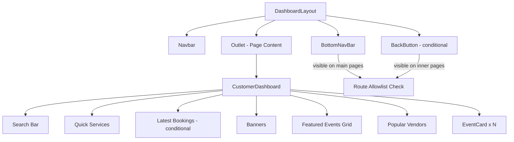

# Design Document: Customer Mobile UI Redesign

## Overview

This design covers the targeted mobile UI improvements to the customer-facing dashboard experience. The goal is a production-grade, mobile-first layout matching the quality bar of apps like BookMyShow and Swiggy — compact typography, consistent navigation patterns, proper icon sizing, and clean visual hierarchy.

The changes are surgical: five existing components are modified, no new routes or data models are introduced. All changes are additive or replacement-level within the existing React/TypeScript/Tailwind stack.

**Affected components:**
- `BottomNavBar.tsx` — icon sizing, height, visibility allowlist
- `DashboardLayout.tsx` — BackButton on inner pages, conditional bottom padding
- `CustomerDashboard.tsx` — section order, Quick Services layout, typography, grid columns
- `EventCard.tsx` — dual action buttons (Book Now + View Details side-by-side)

---

## Architecture

The redesign operates entirely within the existing frontend architecture. No backend changes, no new API endpoints, no new routes.



**Key architectural decision:** Visibility logic for both `BottomNavBar` and `BackButton` is driven by a single shared allowlist of main page paths. This ensures the two components are always in sync — when one is visible, the other is not.

---

## Components and Interfaces

### BottomNavBar

**Current state:** Already mostly correct — 60px height, 22px icons, `block md:hidden`. The main gap is the absence of a route allowlist; the bar currently shows on all customer routes including inner pages.

**Changes:**
1. Add a `MAIN_PAGES` allowlist constant:
   ```ts
   const MAIN_PAGES = [
     "/dashboard",
     "/dashboard/browse-events",
     "/dashboard/my-bookings",
     "/dashboard/profile-settings",
   ];
   ```
2. Add a visibility check using `location.pathname`:
   ```ts
   const isMainPage = MAIN_PAGES.includes(location.pathname);
   if (!isMainPage) return null;
   ```
3. The component already uses `createPortal` to render into `document.body`, so returning `null` removes it from the DOM entirely (satisfies Requirement 2.4).
4. The `Billings` nav item (`/dashboard/billing-payments`) is NOT in the main pages allowlist — it is an inner page. The fifth nav item should be updated to `Settings` (`/dashboard/profile-settings`) to match the allowlist.

**Nav items (final):**
```ts
const navItems = [
  { label: "Home",     icon: Home,         to: "/dashboard" },
  { label: "Events",   icon: CalendarSearch, to: "/dashboard/browse-events" },
  { label: "Bookings", icon: Ticket,        to: "/dashboard/my-bookings" },
  { label: "Billings", icon: CreditCard,    to: "/dashboard/billing-payments" },
  { label: "Settings", icon: Settings,      to: "/dashboard/profile-settings" },
];
```

Note: `Billings` (`/dashboard/billing-payments`) is kept as a nav item for discoverability but is an inner page — navigating to it will hide the BottomNavBar and show the BackButton.

**Revised allowlist** (only the four true main pages):
```ts
const MAIN_PAGES = [
  "/dashboard",
  "/dashboard/browse-events",
  "/dashboard/my-bookings",
  "/dashboard/profile-settings",
];
```

---

### DashboardLayout

**Current state:** Always applies `paddingBottom: "calc(76px + env(safe-area-inset-bottom, 0px))"` regardless of route. No BackButton.

**Changes:**
1. Import `useLocation` and `useNavigate` from `react-router-dom`.
2. Derive `isMainPage` using the same `MAIN_PAGES` allowlist (exported from a shared constant or duplicated).
3. Conditionally render `BackButton` when `!isMainPage`.
4. Conditionally apply bottom padding:
   - Main page: `paddingBottom: "calc(76px + env(safe-area-inset-bottom, 0px))"`
   - Inner page: `paddingBottom: "16px"` (pb-4 equivalent)

**BackButton component (inline or extracted):**
```tsx
const BackButton = () => {
  const navigate = useNavigate();
  return (
    <button
      onClick={() => navigate(-1)}
      className="flex items-center gap-1.5 text-sm font-medium text-muted-foreground hover:text-foreground transition-colors mb-3"
    >
      <ChevronLeft className="h-4 w-4" />
      Back
    </button>
  );
};
```

The BackButton is rendered inside the `<main>` content area, above the `<Outlet />`, so it appears at the top-left of every inner page's content.

**Updated DashboardLayout structure:**
```tsx
<main style={{ ..., paddingBottom: isMainPage ? "calc(76px + ...)" : "16px" }}>
  <div className="max-w-[1600px] mx-auto">
    {!isMainPage && <BackButton />}
    <Outlet />
  </div>
</main>
```

---

### CustomerDashboard

**Current state:** Sections exist but ordering is inconsistent, section headings use `text-2xl`, Featured Events grid uses `gap-6`, Quick Services uses a static `grid-cols-4` (not scrollable).

**Changes:**

#### Section Order
Enforce this render order:
1. Search Bar
2. Quick Services
3. Latest Bookings (conditional — only if `myBookings.length > 0`)
4. Banners/Highlights
5. Pending Ratings Alert
6. Featured Events
7. Popular Vendors
8. Trending Gallery
9. All Events (paginated)

#### Quick Services — Horizontal Scroll
Replace the current `grid-cols-4` with a horizontally scrollable flex row:

```tsx
<div className="flex gap-3 overflow-x-auto pb-1 scrollbar-hide snap-x snap-mandatory">
  {items.map(item => (
    <button
      key={item.id}
      onClick={() => navigate(item.url)}
      className="flex flex-col items-center gap-1.5 p-3 bg-card rounded-xl border border-border
                 hover:border-primary/30 hover:bg-primary/5 transition-all duration-200 group
                 shrink-0 w-[72px] snap-start"
    >
      <span className="text-xl group-hover:scale-110 transition-transform duration-200">{item.emoji}</span>
      <span className="text-[10px] font-semibold text-foreground group-hover:text-primary
                       transition-colors text-center truncate w-full">{item.label}</span>
    </button>
  ))}
</div>
```

Items are built by combining categories (first 6) and service types (first 6), up to 12 total, each with a fixed `w-[72px]` card so they don't stretch.

#### Typography Reduction
- Section headings: `text-base font-display font-bold` (was `text-2xl`)
- Section subtitles: removed (too verbose for mobile)
- Featured Events grid: `gap-3` (was `gap-6`)
- Featured Events grid columns: `grid-cols-2 lg:grid-cols-4` (was `grid-cols-2 sm:grid-cols-2 lg:grid-cols-4` — same, just confirm)

#### Latest Bookings — Compact
The existing list layout is good but uses `text-2xl` heading and `space-y-6` — reduce to `text-base` and `space-y-3`.

---

### EventCard

**Current state:** Customer action row renders Details + Book Now + Share as three separate buttons. The Details button hides its label on small screens (`hidden xs:inline sm:hidden md:inline`), making it confusing.

**Changes:**
Replace the three-button row with a clean two-button row:

```tsx
<div className="flex gap-1.5">
  <Button
    size="sm"
    variant="outline"
    className="h-8 px-3 text-xs border-border text-foreground hover:bg-muted shrink-0"
    onClick={handleViewDetails}
  >
    <Info className="h-3.5 w-3.5 mr-1" />
    Details
  </Button>
  <Button
    size="sm"
    className="flex-1 h-8 text-xs gradient-primary text-white border-none shadow-sm font-semibold"
    onClick={handleBookClick}
    disabled={isSoldOut}
  >
    {isSoldOut ? "Sold Out" : "Book Now"}
  </Button>
</div>
```

- "Details" button: fixed width (`shrink-0`), always shows label, always enabled
- "Book Now" button: `flex-1` (takes remaining width), disabled + "Sold Out" label when sold out
- Share button removed from the primary action row (can be accessed via the card image area or a separate overflow menu if needed)

The `handleViewDetails` function already exists and tracks activity. No logic changes needed.

---

## Data Models

No new data models. All data comes from existing API queries already present in `CustomerDashboard.tsx`:
- `/categories` → Quick Services categories
- `/service-types` → Quick Services service types
- `/events` → Featured Events, All Events
- `/bookings` → Latest Bookings, Pending Ratings
- `/merchants` → Popular Vendors
- `/banners` → Banner carousel
- `/gallery` → Trending Gallery

The Quick Services items are derived client-side by merging categories and service types:

```ts
const quickServiceItems = useMemo(() => {
  const catItems = (categories || []).slice(0, 6).map((cat: any) => ({
    id: `cat-${cat._id || cat.id}`,
    label: cat.name,
    emoji: "✨",
    url: `/dashboard/browse-events?category=${encodeURIComponent(cat.name)}&tab=events`,
  }));
  const stItems = (allServiceTypes || []).slice(0, 6).map((st: any) => ({
    id: `st-${st._id || st.id}`,
    label: st.name,
    emoji: "🛠️",
    url: `/dashboard/browse-events?tab=services&type=${encodeURIComponent(st.name)}`,
  }));
  return [...catItems, ...stItems];
}, [categories, allServiceTypes]);
```

---

## Correctness Properties

*A property is a characteristic or behavior that should hold true across all valid executions of a system — essentially, a formal statement about what the system should do. Properties serve as the bridge between human-readable specifications and machine-verifiable correctness guarantees.*

### Property 1: BottomNavBar visibility on main pages

*For any* route path in the main pages allowlist (`/dashboard`, `/dashboard/browse-events`, `/dashboard/my-bookings`, `/dashboard/profile-settings`), the BottomNavBar component SHALL render a non-null result (be present in the DOM) when the authenticated user is a customer.

**Validates: Requirements 2.1, 2.3**

---

### Property 2: BottomNavBar hidden on inner pages

*For any* route path that is NOT in the main pages allowlist, the BottomNavBar component SHALL return null and not render any DOM nodes.

**Validates: Requirements 2.2, 2.4**

---

### Property 3: BackButton present on inner pages

*For any* route path that is NOT in the main pages allowlist, the DashboardLayout SHALL render a BackButton element in the content area.

**Validates: Requirements 3.1, 3.5**

---

### Property 4: BackButton absent on main pages

*For any* route path in the main pages allowlist, the DashboardLayout SHALL NOT render a BackButton element.

**Validates: Requirements 3.6**

---

### Property 5: Quick Services item count

*For any* combination of categories and service types where the total count is at least 4, the Quick Services section SHALL render at least 4 card items.

**Validates: Requirements 4.2**

---

### Property 6: Quick Services navigation correctness

*For any* category item in the Quick Services section, clicking the card SHALL trigger navigation to a URL containing `/dashboard/browse-events` and the category name as a query parameter.

**Validates: Requirements 4.6**

---

### Property 7: Latest Bookings conditional rendering

*For any* customer with zero bookings, the Latest Bookings section SHALL NOT be rendered. *For any* customer with one or more bookings, the Latest Bookings section SHALL be rendered.

**Validates: Requirements 5.5, 5.6**

---

### Property 8: EventCard dual buttons for active events

*For any* event with status not equal to `"completed"` or `"cancelled"`, the EventCard rendered with `showActions="customer"` SHALL contain both a "Details" button and a "Book Now" button in the action row.

**Validates: Requirements 6.1, 6.2**

---

### Property 9: Sold-out button state

*For any* event where `isSoldOut` is true, the "Book Now" button SHALL be disabled and display the text "Sold Out", while the "Details" button SHALL remain enabled.

**Validates: Requirements 6.4, 6.5**

---

### Property 10: DashboardLayout bottom padding by page type

*For any* inner page route, the DashboardLayout main content area SHALL apply a reduced bottom padding (equivalent to `pb-4` / 16px). *For any* main page route, it SHALL apply the full BottomNavBar-height padding (`calc(76px + env(safe-area-inset-bottom, 0px))`).

**Validates: Requirements 8.2, 8.3**

---

**Property Reflection:**

- Properties 1 and 2 are complementary inverses — both are needed (one tests presence, one tests absence).
- Properties 3 and 4 are complementary inverses — both are needed.
- Properties 8 and 9 are not redundant: Property 8 tests that both buttons exist for active events; Property 9 tests the specific disabled/label state for sold-out events. They cover different conditions.
- Property 10 consolidates Requirements 8.2 and 8.3 into a single round-trip-style property covering both branches.

---

## Error Handling

### BottomNavBar
- If `user` is null or role is not `"customer"`, return null (already implemented).
- If `location.pathname` is undefined (edge case in test environments), default to treating it as an inner page (hide the bar).

### DashboardLayout
- If `navigate(-1)` is called with no history (e.g., direct deep link), the browser will navigate to the previous page or do nothing — this is acceptable default browser behavior.
- The `isMainPage` check uses `===` exact match, not `startsWith`, to avoid false positives (e.g., `/dashboard/browse-events/detail` should be an inner page).

### CustomerDashboard
- Quick Services renders gracefully with 0 items (empty section, no crash).
- Latest Bookings section is guarded by `myBookings.length > 0` — no empty state needed.
- Featured Events falls back to an empty grid if the API returns no events.

### EventCard
- `isSoldOut` is derived from either the explicit flag or ticket type remaining quantities — both paths are already handled.
- `onViewDetails` and `onBook` are optional props; the buttons are only rendered when `showActions === "customer"`, so missing handlers won't cause crashes (they use optional chaining `?.`).

---

## Testing Strategy

### Unit Tests (Example-Based)

Focus on specific rendering scenarios and interaction behaviors:

1. **BottomNavBar renders 5 nav items** — render with customer user, assert 5 `NavLink` elements.
2. **BottomNavBar icon size** — assert each `Icon` receives `size={22}`.
3. **BottomNavBar active state** — render with `/dashboard` route, assert Home link has active styling.
4. **BackButton click calls navigate(-1)** — mock `useNavigate`, click BackButton, assert `navigate` called with `-1`.
5. **BackButton label and icon** — assert "Back" text and `ChevronLeft` icon are present.
6. **EventCard Details button always visible** — render sold-out event, assert Details button is not disabled.
7. **EventCard Book Now disabled when sold out** — render sold-out event, assert Book Now is disabled with "Sold Out" text.
8. **CustomerDashboard section order** — render with mock data, assert sections appear in specified DOM order.
9. **CustomerDashboard grid columns** — assert Featured Events grid has `grid-cols-2` class.
10. **DashboardLayout padding on main page** — render with `/dashboard` route, assert paddingBottom includes `76px`.

### Property-Based Tests

PBT library: **fast-check** (already available in the JS ecosystem, works with Vitest).

Each property test runs a minimum of **100 iterations**.

**Tag format:** `Feature: customer-mobile-ui-redesign, Property {N}: {property_text}`

1. **Property 1 — BottomNavBar visible on main pages**
   - Generator: sample from the 4-item main pages allowlist
   - Assert: component renders non-null
   - Tag: `Feature: customer-mobile-ui-redesign, Property 1: BottomNavBar visible on main pages`

2. **Property 2 — BottomNavBar hidden on inner pages**
   - Generator: arbitrary string path that is NOT in the allowlist (e.g., `/dashboard/saved-events`, `/dashboard/calendar`, random `/dashboard/x` paths)
   - Assert: component returns null
   - Tag: `Feature: customer-mobile-ui-redesign, Property 2: BottomNavBar hidden on inner pages`

3. **Property 3 — BackButton present on inner pages**
   - Generator: arbitrary inner page path
   - Assert: BackButton element is in the rendered output
   - Tag: `Feature: customer-mobile-ui-redesign, Property 3: BackButton present on inner pages`

4. **Property 4 — BackButton absent on main pages**
   - Generator: sample from main pages allowlist
   - Assert: no BackButton element in rendered output
   - Tag: `Feature: customer-mobile-ui-redesign, Property 4: BackButton absent on main pages`

5. **Property 5 — Quick Services item count**
   - Generator: arrays of categories (length 0–8) and service types (length 0–8) where total >= 4
   - Assert: rendered Quick Services section contains >= 4 card buttons
   - Tag: `Feature: customer-mobile-ui-redesign, Property 5: Quick Services item count`

6. **Property 6 — Quick Services navigation correctness**
   - Generator: arbitrary category name string
   - Assert: clicking the category card calls navigate with a URL containing `/dashboard/browse-events` and the encoded category name
   - Tag: `Feature: customer-mobile-ui-redesign, Property 6: Quick Services navigation correctness`

7. **Property 7 — Latest Bookings conditional rendering**
   - Generator: booking arrays of length 0 and length 1–10
   - Assert: section absent when length=0, present when length>=1
   - Tag: `Feature: customer-mobile-ui-redesign, Property 7: Latest Bookings conditional rendering`

8. **Property 8 — EventCard dual buttons for active events**
   - Generator: events with status sampled from `{upcoming, live}` and arbitrary title/price/date
   - Assert: both "Details" and "Book Now" buttons present in rendered output
   - Tag: `Feature: customer-mobile-ui-redesign, Property 8: EventCard dual buttons for active events`

9. **Property 9 — Sold-out button state**
   - Generator: events with `isSoldOut=true` and arbitrary other fields
   - Assert: Book Now is disabled + shows "Sold Out"; Details is not disabled
   - Tag: `Feature: customer-mobile-ui-redesign, Property 9: Sold-out button state`

10. **Property 10 — DashboardLayout bottom padding by page type**
    - Generator: main page paths (from allowlist) and inner page paths (arbitrary non-allowlist paths)
    - Assert: main page → paddingBottom contains `76px`; inner page → paddingBottom is `16px`
    - Tag: `Feature: customer-mobile-ui-redesign, Property 10: DashboardLayout bottom padding by page type`

### Integration / Smoke Tests

- **Visual smoke test at 375px:** Verify no horizontal overflow on CustomerDashboard home screen.
- **Visual smoke test at 320px:** Verify EventCard action row buttons remain aligned.
- **Navigation smoke test:** Verify BottomNavBar active state updates on route change without full reload.
