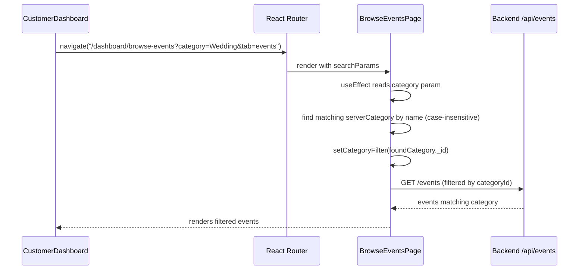
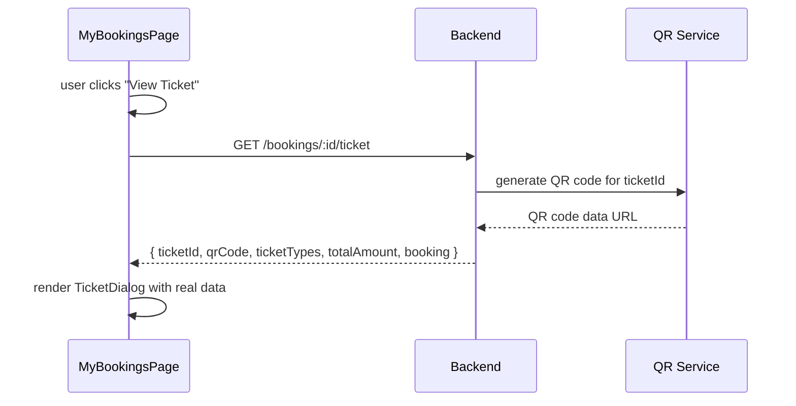

# Design Document: Event Platform Enhancements

## Overview

Four targeted improvements to the event booking platform: merchant service type/category management, a back-navigation button on the browse events page, fixing Quick Services category filtering on the customer dashboard, and proper ticket generation with a working QR code.

The app is a React + TypeScript SPA using shadcn/ui components, React Query for data fetching, and React Router for navigation. The backend is at `http://localhost:5000/api`.

---

## Architecture

```mermaid
graph TD
    A[CustomerDashboard] -->|navigate with category param| B[BrowseEventsPage]
    B -->|Back button| C[Previous Page via useNavigate -1]
    D[ServicesPage] -->|category dropdown| E[/api/service-types]
    F[CategoriesPage] -->|existing CRUD| G[/api/categories]
    H[ServiceTypesPage NEW] -->|CRUD| E
    I[MyBookingsPage] -->|View Ticket| J[TicketDialog]
    J -->|fetch| K[/api/bookings/:id/ticket]
    K -->|returns| L[ticketId + QR code URL + ticket details]
```

---

## Sequence Diagrams

### Quick Services Fix Flow



### Ticket Generation Flow



---

## Components and Interfaces

### 1. ServiceTypesPage (New Page)

**Purpose**: Admin/merchant management of service types (like CategoriesPage but for service types — e.g., Catering, Photography, Decoration).

**Interface**:
```typescript
interface ServiceType {
  _id: string;
  name: string;
  description?: string;
  icon?: string;
  isDefault: boolean;  // default types can't be deleted
  createdAt: string;
}
```

**Responsibilities**:
- List all service types (default + custom)
- Add new service type
- Edit existing custom service types
- Delete custom service types (default ones are protected)
- Used as the `type` dropdown source in ServicesPage

**Route**: `/dashboard/service-types` (accessible to `organizer`, `admin`, `merchant`)

---

### 2. ServicesPage — Category & Type Dropdowns

**Current issue**: `category` dropdown pulls from `/api/categories?merchantId=...` but `type` is hardcoded as `WEDDING_SERVICES` or `GENERAL_SERVICES` arrays.

**Change**: Replace hardcoded `type` array with a query to `/api/service-types`.

```typescript
// New query in ServicesPage
const { data: serviceTypes = [] } = useQuery({
  queryKey: ['service-types'],
  queryFn: async () => {
    const response = await api.get('/service-types');
    return response.data as ServiceType[];
  },
});
```

The `type` Select in the form will render `serviceTypes.map(st => st.name)` instead of the hardcoded arrays.

---

### 3. BrowseEventsPage — Back Button

**Purpose**: Add a "Back to Previous Page" button at the top of the page.

**Interface**:
```typescript
// Uses React Router's useNavigate hook
const navigate = useNavigate(); // already imported
// Button onClick:
() => navigate(-1)
```

**Placement**: Top-left of the page header, before the title. Only shown when there is history to go back to (i.e., `window.history.length > 1`).

```tsx
{window.history.length > 1 && (
  <Button variant="ghost" size="sm" onClick={() => navigate(-1)}>
    <ArrowLeft className="h-4 w-4 mr-2" /> Back
  </Button>
)}
```

---

### 4. CustomerDashboard — Quick Services Fix

**Current issue**: Quick Services navigate with `?category=wedding` but `BrowseEventsPage` matches category by comparing `c.name.toLowerCase().includes(category.toLowerCase())`. This works for "Wedding" but fails for "Birthday", "Catering", and "Photography" because:
- "Birthday" → no event category named "Birthday" (it's "Birthday Party" or similar)
- "Catering" → this is a service type, not an event category
- "Photography" → same, service type not event category

**Fix**: Change Quick Services to navigate to the services tab for Catering and Photography, and use exact category name matching for Wedding and Birthday.

```typescript
const quickServices = [
  { label: "Wedding",     icon: "💒", url: "/dashboard/browse-events?category=Wedding&tab=events" },
  { label: "Birthday",    icon: "🎂", url: "/dashboard/browse-events?category=Birthday&tab=events" },
  { label: "Catering",    icon: "🍽️", url: "/dashboard/browse-events?tab=services&type=Catering" },
  { label: "Photography", icon: "📸", url: "/dashboard/browse-events?tab=services&type=Photography" },
];
```

Also fix `BrowseEventsPage` `useEffect` to handle the `type` param for the services tab:
```typescript
if (type) {
  setServiceTypeFilter(type);
  setActiveTab("services"); // already handled
}
```

The category matching in `useEffect` already does `c.name.toLowerCase().includes(category.toLowerCase())` — this will correctly match "Wedding" → "Wedding Planning" and "Birthday" → "Birthday Party". No change needed there.

---

### 5. MyBookingsPage — Ticket Generation Fix

**Current issue**: `selectedBooking.billQrCode` is used as the QR code source, but this field is often `undefined`, leaving the spinner stuck.

**Fix**: When the ticket dialog opens, fetch ticket details from a dedicated endpoint. If the endpoint doesn't exist yet, generate a QR code client-side using the booking ID.

```typescript
// New state
const [ticketData, setTicketData] = useState<TicketData | null>(null);
const [ticketLoading, setTicketLoading] = useState(false);

interface TicketData {
  ticketId: string;
  qrCodeUrl: string;       // data URL from server or generated client-side
  selectedTickets?: { name: string; quantity: number; price: number }[];
  totalAmount: number;
  eventTitle: string;
  eventDate: string;
  customerName: string;
  guests: number;
  venue?: string;
}
```

**QR Code generation strategy** (client-side fallback):
- Use `qrcode` npm package to generate a QR code data URL from the ticket ID
- The QR encodes: `ticketId|bookingId|eventTitle|eventDate`

```typescript
import QRCode from 'qrcode';

const generateTicketQR = async (booking: Booking): Promise<string> => {
  const ticketId = (booking as any).ticketId || `TKT-${booking.id.slice(-8).toUpperCase()}`;
  const payload = `${ticketId}|${booking.id}|${booking.eventTitle}|${booking.eventDate}`;
  return await QRCode.toDataURL(payload, { width: 200, margin: 2 });
};
```

**Ticket dialog content** (enhanced):
- Ticket ID (prominent)
- Event title + date
- Customer name
- Ticket types booked (from `booking.selectedTickets` or `booking.ticketType`)
- Total amount paid
- QR code (generated, not stuck spinner)
- Download button (downloads the QR as PNG)

---

## Data Models

### ServiceType

```typescript
interface ServiceType {
  _id: string;
  name: string;           // e.g. "Catering", "Photography"
  description?: string;
  icon?: string;          // emoji or icon name
  isDefault: boolean;     // true = system default, cannot delete
  merchantId?: string;    // null = global/admin-created
  createdAt: string;
}
```

**Default service types** (seeded in backend):
- Catering, Decoration, Photography, Music/DJ, Lighting, Makeup Artist, Venue, Security, Other

### TicketData (frontend-only interface)

```typescript
interface TicketData {
  ticketId: string;
  qrCodeUrl: string;
  selectedTickets: { name: string; quantity: number; price: number }[];
  totalAmount: number;
  eventTitle: string;
  eventDate: string;
  customerName: string;
  guests: number;
}
```

---

## Key Functions with Formal Specifications

### generateTicketQR(booking)

```typescript
async function generateTicketQR(booking: Booking): Promise<string>
```

**Preconditions**:
- `booking` is non-null
- `booking.id` is a non-empty string

**Postconditions**:
- Returns a valid `data:image/png;base64,...` URL
- QR code encodes a string containing `booking.id`
- Never throws (catches errors and returns a fallback empty string)

**Loop Invariants**: N/A (no loops)

---

### buildTicketData(booking)

```typescript
function buildTicketData(booking: Booking): TicketData
```

**Preconditions**:
- `booking` is non-null with valid `id`, `eventTitle`, `eventDate`, `customerName`

**Postconditions**:
- Returns a `TicketData` object with all required fields populated
- `ticketId` is either `booking.ticketId` or a derived `TKT-XXXXXXXX` string
- `totalAmount` is `booking.finalAmount ?? (booking.totalPrice + (booking.additionalCost ?? 0))`
- `selectedTickets` is derived from `booking.selectedTickets` or `[{ name: booking.ticketType ?? 'General', quantity: booking.quantity ?? booking.guests, price: booking.totalPrice }]`

---

### Quick Services category matching (BrowseEventsPage useEffect)

```typescript
// Existing logic — works correctly for partial name matching
const foundCategory = serverCategories.find((c: any) =>
  c.name.toLowerCase().includes(category.toLowerCase()) ||
  category.toLowerCase().includes(c.name.toLowerCase())
);
```

**Preconditions**:
- `serverCategories` is loaded
- `category` is a non-empty string from URL param

**Postconditions**:
- If a matching category is found, `setCategoryFilter` is called with its `_id`
- If no match, `categoryFilter` remains `"all"` (shows all events)

---

## Algorithmic Pseudocode

### Ticket Dialog Open Flow

```pascal
PROCEDURE openTicketDialog(booking)
  INPUT: booking of type Booking
  OUTPUT: side effect — sets ticketData state

  BEGIN
    setSelectedBooking(booking)
    setTicketLoading(true)
    setTicketDialogOpen(true)

    TRY
      // Try server endpoint first
      response ← api.GET('/bookings/' + booking.id + '/ticket')
      ticketData ← response.data
    CATCH error
      // Fallback: build client-side
      qrUrl ← AWAIT generateTicketQR(booking)
      ticketData ← buildTicketData(booking)
      ticketData.qrCodeUrl ← qrUrl
    END TRY

    setTicketData(ticketData)
    setTicketLoading(false)
  END
END PROCEDURE
```

### Quick Services Navigation Fix

```pascal
PROCEDURE handleQuickServiceClick(service)
  INPUT: service with { label, icon, url }

  BEGIN
    IF service.label IN ['Catering', 'Photography'] THEN
      // These are service types, not event categories
      // Navigate to services tab with type filter
      navigate('/dashboard/browse-events?tab=services&type=' + service.label)
    ELSE
      // Wedding, Birthday — event categories
      navigate('/dashboard/browse-events?category=' + service.label + '&tab=events')
    END IF
  END
END PROCEDURE
```

---

## Example Usage

### Back Button in BrowseEventsPage

```tsx
// In the page header section
<div className="flex flex-col md:flex-row justify-between items-start md:items-end gap-6">
  <div className="flex items-center gap-3">
    {window.history.length > 1 && (
      <Button variant="ghost" size="sm" onClick={() => navigate(-1)} className="gap-2">
        <ArrowLeft className="h-4 w-4" /> Back
      </Button>
    )}
    <div>
      <h1 className="text-4xl font-display font-bold">{t('explore_events_services')}</h1>
      <p className="text-muted-foreground mt-2 text-lg">{t('find_perfect_celebration')}</p>
    </div>
  </div>
</div>
```

### ServiceTypesPage — Add Service Type

```tsx
// Reuses same pattern as CategoriesPage
addMutation.mutate({ name: "Floral Design", description: "...", isDefault: false });
// → POST /api/service-types
// → invalidate ['service-types'] query
// → ServicesPage type dropdown auto-updates
```

### Ticket Dialog with QR

```tsx
// On dialog open
useEffect(() => {
  if (ticketDialogOpen && selectedBooking) {
    openTicketDialog(selectedBooking);
  }
}, [ticketDialogOpen, selectedBooking]);

// In dialog JSX
{ticketLoading ? (
  <Loader2 className="h-8 w-8 animate-spin text-primary" />
) : ticketData?.qrCodeUrl ? (
  
) : null}
```

---

## Error Handling

### Ticket QR Generation Failure

**Condition**: `qrcode` library throws or `api.get('/bookings/:id/ticket')` returns 404  
**Response**: Catch error, fall back to client-side QR generation using booking ID  
**Recovery**: If client-side also fails, show a text-based ticket ID instead of QR image

### Service Type API Unavailable

**Condition**: `/api/service-types` endpoint doesn't exist yet  
**Response**: `useQuery` returns error, `serviceTypes` defaults to `[]`  
**Recovery**: ServicesPage falls back to showing the hardcoded `GENERAL_SERVICES` array

### Quick Services — Category Not Found

**Condition**: `serverCategories` doesn't contain a category matching the URL param  
**Response**: `foundCategory` is `undefined`, `setCategoryFilter` is not called  
**Recovery**: `categoryFilter` stays `"all"`, all events are shown (graceful degradation)

---

## Testing Strategy

### Unit Testing

- `buildTicketData(booking)` — test with various booking shapes (ticketed, service, missing fields)
- `generateTicketQR(booking)` — verify returns a valid data URL string
- Quick Services URL construction — verify correct tab and filter params per service label

### Integration Testing

- Navigate from CustomerDashboard Quick Services → BrowseEventsPage → verify correct events shown
- Open ticket dialog for a paid ticketed booking → verify QR renders (not spinner)
- Add service type in ServiceTypesPage → verify it appears in ServicesPage type dropdown
- Back button on BrowseEventsPage → verify navigates to previous page

### Edge Cases

- Ticket dialog opened for booking with no `selectedTickets` → shows fallback single ticket row
- Quick Services "Catering" click → lands on services tab, not events tab
- Back button when navigated directly to `/dashboard/browse-events` (no history) → button hidden

---

## Dependencies

- `qrcode` npm package (for client-side QR code generation) — `npm install qrcode @types/qrcode`
- All other dependencies already present: React Query, React Router, shadcn/ui, lucide-react, sonner

---

## Correctness Properties

*A property is a characteristic or behavior that should hold true across all valid executions of a system — essentially, a formal statement about what the system should do. Properties serve as the bridge between human-readable specifications and machine-verifiable correctness guarantees.*

### Property 1: All service types are rendered

*For any* array of service types returned by the API (mix of default and custom), every item in the array should appear in the ServiceTypesPage list.

**Validates: Requirements 1.1**

### Property 2: Default service types cannot be deleted

*For any* service type with `isDefault: true`, the delete action rendered by ServiceTypesPage should be disabled.

**Validates: Requirements 1.6**

### Property 3: Service type name validation rejects blank input

*For any* string composed entirely of whitespace (including the empty string), submitting it as a new service type name should be rejected and no POST request should be sent.

**Validates: Requirements 1.3**

### Property 4: ServicesPage dropdown reflects API results

*For any* array of service types returned by `/api/service-types`, every type name should appear as a selectable option in the ServicesPage type dropdown.

**Validates: Requirements 2.1**

### Property 5: Back button visibility matches history depth

*For any* render of BrowseEventsPage, the back button is visible if and only if `window.history.length > 1`.

**Validates: Requirements 3.1, 3.3**

### Property 6: Category URL param applies correct filter

*For any* non-empty `category` URL parameter and any list of server categories, BrowseEventsPage should set the category filter to the `_id` of the first category whose name partially matches (case-insensitive), or leave the filter as `"all"` if no match exists.

**Validates: Requirements 4.5, 4.7**

### Property 7: Type URL param activates services tab

*For any* non-empty `type` URL parameter, BrowseEventsPage should set the service type filter to that value and activate the services tab.

**Validates: Requirements 4.6**

### Property 8: Ticket dialog renders required fields for any booking

*For any* booking with valid `id`, `eventTitle`, `eventDate`, `customerName`, and `guests`, the rendered TicketDialog should display all five of those values and at least one ticket row.

**Validates: Requirements 5.5, 5.6, 5.7, 5.8**

### Property 9: QR code replaces spinner when data is loaded

*For any* TicketData with a non-empty `qrCodeUrl`, the TicketDialog should render an `` element with that URL and no loading spinner.

**Validates: Requirements 5.4, 5.9**

### Property 10: QR code encodes required booking fields

*For any* booking, the QR payload produced by `generateTicketQR` should contain the ticket ID, booking ID, event title, and event date as substrings.

**Validates: Requirements 6.1**

### Property 11: QR generator returns a valid data URL

*For any* valid booking input, `generateTicketQR` should return a string matching `^data:image/png;base64,`.

**Validates: Requirements 6.2**

### Property 12: QR generator never throws

*For any* input (including malformed or missing fields), `generateTicketQR` should return a string (possibly empty) and never throw an exception.

**Validates: Requirements 6.3**
